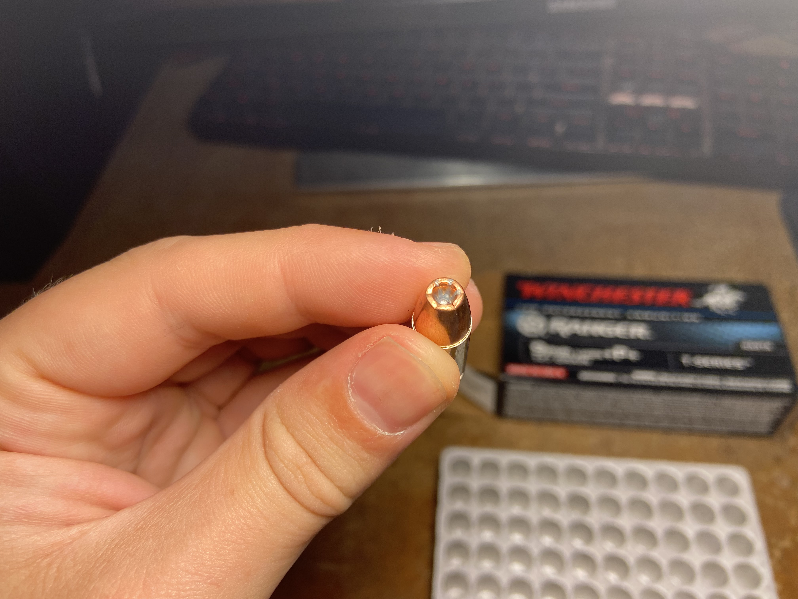

# Cartridge Literature

A repository containing documents relating to all kinds of cartridges.

## Winchester

Dating Winchester/Western Ammo Boxes. For this repo I will be dating current boxes and using examples of boxes I have recently purchased in South Africa.

Article on how to read the date stamps https://www.mdshooters.com/showthread.php?t=178198&highlight=winchester+dating

### Summarized

#### **Winchester**

**`Dating`** Boxes by Lot Numbers

1.Western Since 1928 and **`Winchester`** Since 1958

Since **1958** the lot numbers used on **`Winchester`** boxes are in the same format as used by Western since about **1928**, and repeat every twenty years. The lot number will have a letter-letter-number or letter-letter-number-number series that indicated the date. The first letter indicates the year, the second letter the month. If followed by a single digit, that equates to a single digit day; if followed by two digits, the numbers are reversed to equate with a two digit day or dingle digit day with a leading zero. Examples: **10=01**, **60=06**, **21=12**, **61=16**, **82=28**, **13=31**.
Hence the series **DA82** will equate to 28 January **1930** or **1950** or **1970** or **1990** or **2010**, depending on the box design. Additional numbers and/or letters equate to production lines, operator or inspector numbers.

1.1 Years

To repeat every 20 years using our 26-letter alphabet, six letters were skipped: A, I, J, O, Q, and Z.

| letter  |  year  | year  | year  | year  | year  |
| :------------ | :------------ | :------------ | :------------ |:------------ |:------------ |
|`B`|1928 |1948 |1968 |1988 |2008 |
|`C`|1929 |1949 |1969 |1989 |2009 |
|`D`|1930 |1950 |1970 |1990 |2010 |
|`E`|1931 |1951 |1971 |1991 |2011 |
|`F`|1932 |1952 |1972 |1992 |2012 |
|`G`|1933 |1953 |1973 |1993 |2013 |
|`H`|1934 |1954 |1974 |1994 |2014 |
|`K`|1935 |1955 |1975 |1995 |2015 |
|`L`|1936 |1956 |1976 |1996 |2016 |
|`M`|1937 |1957 |1977 |1997 |2017 |
|`N`|1938 |1958 |1978 |1998 |2018 |
|`P`|1939 |1959 |1979 |1999 |2019 |
|`R`|1940 |1960 |1980 |2000 |2020 |
|`S`|1941 |1961 |1981 |2001 |2021 |
|`T`|1942 |1962 |1982 |2002 |2022 |
|`U`|1943 |1963 |1983 |2003 |2023 |
|`V`|1944 |1964 |1984 |2004 |2024 |
|`W`|1945 |1965 |1985 |2005 |2025 |
|`X`|1946 |1966 |1986 |2006 |2026 |
|`Y`|1947 |1967 |1987 |2007 |2027 |

# Links

- https://winchester.com
- https://winchesterle.com
- 

> Dating source https://www.mdshooters.com/showthread.php?t=178198&highlight=winchester+dating
